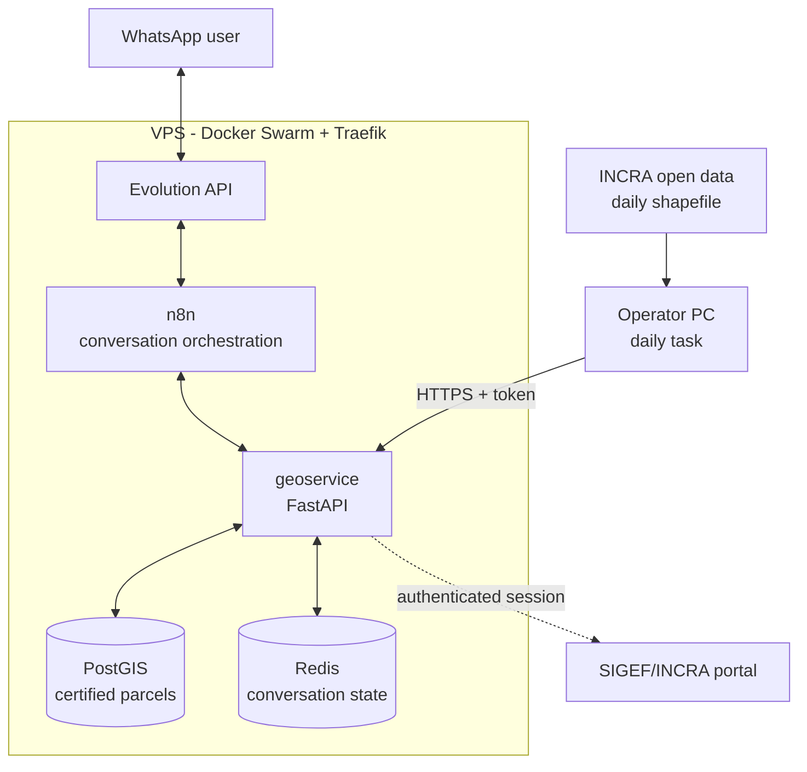

# SIGEF Bot

> Query Brazil's certified rural land parcels straight from WhatsApp — returning official survey plans, boundary descriptions, vertex spreadsheets and geospatial files.

[Versão em português](README.md)

---

## The problem

In Brazil, every rural property must have its boundaries surveyed and certified by INCRA (the federal land agency) through **SIGEF**, the national land management system. The data is public — but getting to it is not simple.

Field professionals (surveyors, engineers, land registry offices) frequently need answers on the spot:

- is this area already certified?
- what are the official vertices and adjoining properties of this parcel?
- I need the boundary description and survey plan to file a case

Today that means opening the SIGEF portal in a browser, authenticating, navigating several screens and downloading files one by one. In the field, on a weak mobile connection, it is not practical.

**This project turns that lookup into a WhatsApp conversation that takes seconds.**

---

## Demo

The agent receives a location and returns the certified parcel record:


Official boundaries are drawn over satellite imagery, and the user picks what to receive:


Document delivery, with a choice of coordinate system:


The result: a vertex spreadsheet faithful to SIGEF, with official codes, coordinates, standard deviations, positioning method and boundary type:


---

## What it does

**Ways to locate a property**

| Method | Example |
|---|---|
| Geographic or UTM coordinates, or a WhatsApp location pin | `-22.3683, -44.1328` |
| Certified parcel code (SIGEF UUID) | `7928dbbe-0440-46d9-846f-...` |
| National rural registry code (SNCR / CCIR) | — |
| Vertex code *(in development — see limitations)* | `FJML-P-0001` |

**What it returns**

- Parcel record: name, area, registry number, status and certification date
- Satellite image with the certified perimeter drawn on it
- **Survey plan (A4) and boundary description** — official SIGEF PDFs
- **Vertex, boundary and adjoining-property spreadsheet** (`.ods`), in UTM or geographic coordinates
- **KML and Shapefile** of the polygon

---

## Architecture



**Two data sources, by design:**

1. **Local base (PostGIS)** — a copy of the public shapefile, synchronised daily. Answers spatial queries in milliseconds without depending on the portal.
2. **SIGEF portal (authenticated session)** — used only for official documents (survey plan, boundary description, vertex and limit CSVs) that do not exist in the public shapefile.

---

## Numbers

| | |
|---|---|
| Certified parcels in the database (Rio de Janeiro) | ~14,000 |
| Full synchronisation cycle | ~15 s (27 MB download + processing) |
| Update frequency | daily |
| Output formats | PDF, ODS, KML, SHP, PNG |
| Infrastructure | 1 VPS (2 vCPU / 4 GB), Docker Swarm |

---

## Engineering decisions

This section exists because the hard calls say more about a project than the list of technologies does.

### 1. Not circumventing anti-bot protection

Mid-development, the SIGEF portal moved behind a WAF (F5 BIG-IP / Shape). Extraction through a plain HTTP client, which had been working, started being blocked.

There were technical routes around it — fingerprint masking, solving the challenge programmatically. **They were rejected on principle:** circumventing a security control on a public government system is indefensible, and it is an arms race you lose anyway.

The adopted solution respects the control: a **real browser**, ordinary profile, authenticated **by a person**. The automation attaches to that existing session (via CDP) and performs only the downloads that user could perform by hand. No challenge is solved in code, no fingerprint is masked.

*Accepted trade-off:* it requires periodic human involvement. In exchange, the system does not depend on defeating anything and does not break with every WAF update.

### 2. Closing the database, inverting the flow

The first synchronisation design exposed the PostgreSQL port to the internet, firewalled to the operator's IP. It worked — until that residential IP changed, at which point the sync started failing **silently**.

Rather than patching around it (a script to update the firewall rule via API), the flow was inverted: the PC only **downloads and uploads** the file; all processing moved into the service. Communication became a `POST /sync/upload` over HTTPS, authenticated by a **Docker secret**.

Result: the database port was closed, Postgres left the public internet, and the dynamic IP stopped being a risk.

### 3. Masking by default (privacy law)

SIGEF data is public, but includes owner names and national ID numbers. The agent returns only technical and registry data — **names and ID numbers are omitted by default**, with no option to reveal them.

### 4. Observability before convenience

A synchronisation routine written months earlier had never once run successfully — it failed on missing configuration, and nobody knew, because there was no failure notification. The database sat frozen for weeks without a single signal.

Since then, every automated task reports both failure and success through a webhook. *Code that works and code you know is working are different things.*

---

## Stack

**Backend** · Python 3.12 · FastAPI · GeoPandas · Shapely · pyproj · psycopg
**Data** · PostgreSQL + PostGIS 16 · Redis
**Orchestration** · n8n · Evolution API (WhatsApp)
**Infrastructure** · Docker Swarm · Traefik (TLS via Let's Encrypt) · Docker secrets
**Automation** · Playwright (CDP) · Task Scheduler

---

## Repository layout

```
geoservice/
  app/
    main.py       # API routes and conversation state machine
    sigef.py      # authenticated session and official SIGEF downloads
    exports.py    # ODS, KML, SHP and map generation
    parsing.py    # coordinate parsing (decimal, DMS, UTM)
    sync.py       # authenticated shapefile intake endpoint
    db.py         # PostGIS access
  Dockerfile
  requirements.txt
sql/schema.sql            # parcel database schema
swarm/                    # Docker Swarm stack (example, no credentials)
n8n/                      # exported workflows (sanitised)
sync_windows/             # daily synchronisation routine
docs/INSTALL_SWARM.md     # installation guide
```

---

## Status and limitations

- **Vertex code search: not functional.** The SIGEF portal answers `GET /consultar/parcelas/?vertice=` with an empty page — the form appears to require `POST`, and that hypothesis is still unconfirmed. It is the only one of the four lookup methods not yet returning results.
- **Coverage:** Rio de Janeiro state. The schema already supports multiple states — duplicate the sync task pointing at the matching dataset.
- **Official documents** depend on an authenticated session renewed by a human.
- **Accepted fragility:** SIGEF endpoints may change without notice. The system degrades to the local database and notifies the administrator.
- This is a personal project with **no affiliation to INCRA**. It consumes only public data and public endpoints.

---

## Author

**César Alves** — Environmental and Sanitary Engineer, INCRA-accredited for rural property surveying, working with automation and AI agents.

This project sits at the intersection of both worlds: 13 years of fieldwork in land surveying and cadastral registration, applied to automation.
