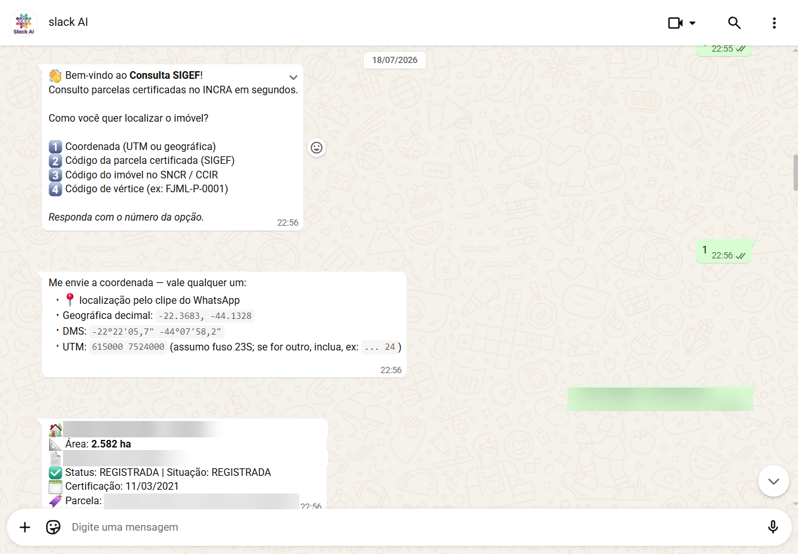
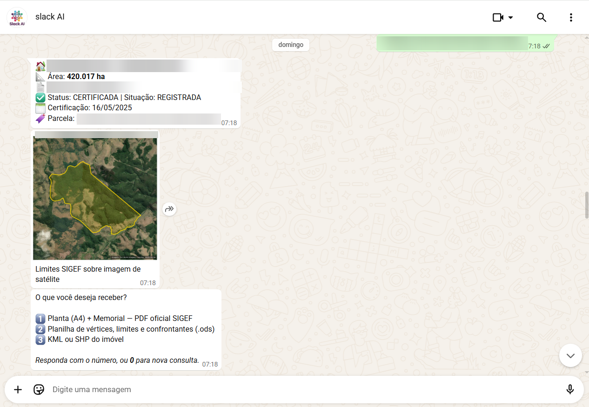
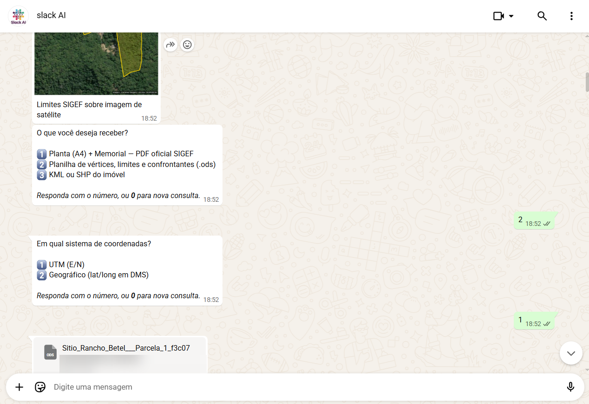
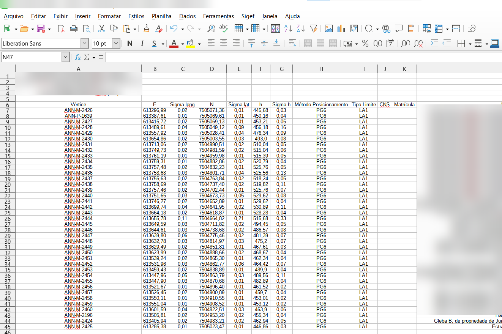
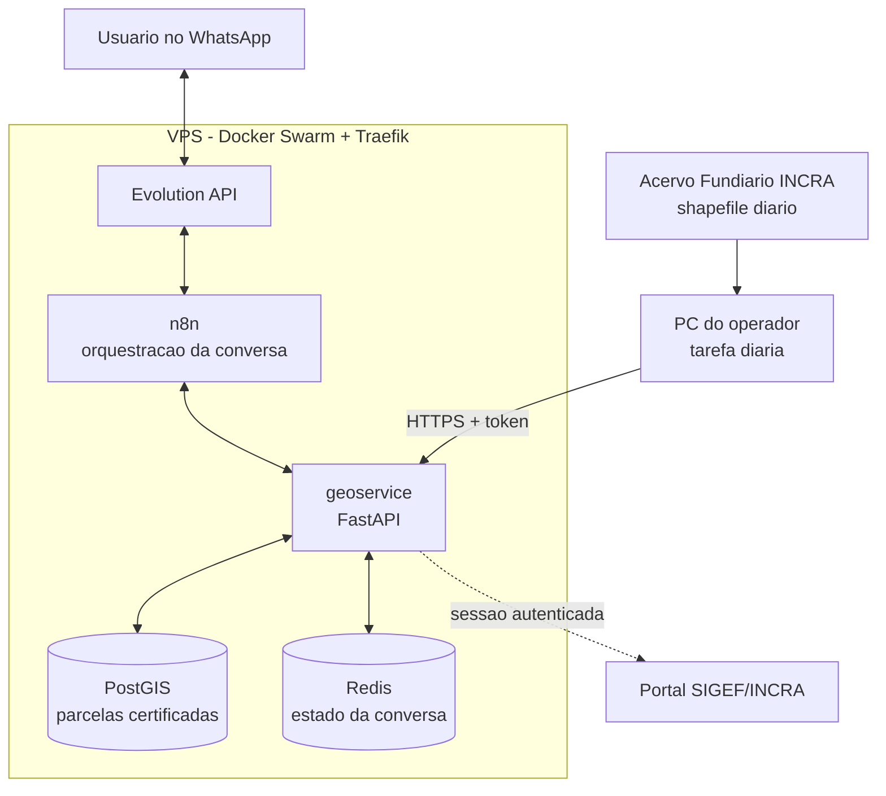

# SIGEF Bot

> Consulta de parcelas rurais certificadas pelo INCRA direto no WhatsApp — com entrega de planta, memorial descritivo, planilha de vértices e arquivos geoespaciais.

[English version](README.en.md)

---

## O problema

No Brasil, todo imóvel rural precisa ter seus limites georreferenciados e certificados pelo INCRA através do **SIGEF** (Sistema de Gestão Fundiária). Esses dados são públicos — mas consultá-los não é simples.

Quem trabalha em campo (topógrafos, engenheiros, agrimensores, cartórios) precisa saber, com frequência e às pressas, coisas como:

- essa área onde estou já está certificada?
- quais são os vértices oficiais e os confrontantes desta parcela?
- preciso do memorial descritivo e da planta para instruir um processo

Hoje isso exige abrir o portal do SIGEF em um navegador, autenticar, navegar por várias telas e baixar arquivo por arquivo. Em campo, com sinal de celular ruim, é inviável.

**Este projeto transforma essa consulta em uma conversa de WhatsApp que leva segundos.**

---

## Demonstração

O agente recebe a localização e devolve a ficha da parcela certificada:



Os limites oficiais são desenhados sobre imagem de satélite, e o usuário escolhe o que quer receber:



A entrega dos documentos oficiais, com escolha do sistema de coordenadas:



E o resultado: planilha de vértices fiel ao SIGEF, com códigos oficiais, coordenadas, sigmas, método de posicionamento e tipo de limite:



---

## O que o agente faz

**Formas de localizar o imóvel**

| Método | Exemplo |
|---|---|
| Coordenada geográfica, UTM ou pin do WhatsApp | `-22.3683, -44.1328` |
| Código da parcela certificada (UUID SIGEF) | `7928dbbe-0440-46d9-846f-...` |
| Código do imóvel no SNCR / CCIR | — |
| Código de vértice *(em desenvolvimento — ver limitações)* | `FJML-P-0001` |

**O que ele entrega**

- Ficha da parcela: denominação, área, matrícula, CNS, status e data de certificação
- Imagem de satélite com o perímetro certificado desenhado
- **Planta (A4) e memorial descritivo** — PDFs oficiais do SIGEF
- **Planilha de vértices, limites e confrontantes** (`.ods`), em UTM ou geográfico
- **KML e Shapefile** do polígono

---

## Arquitetura



**Duas fontes de dados, por design:**

1. **Base local (PostGIS)** — cópia do shapefile público do Acervo Fundiário, sincronizada diariamente. Responde consultas espaciais em milissegundos, sem depender do portal.
2. **Portal SIGEF (sessão autenticada)** — usado apenas para os documentos oficiais (planta, memorial, CSVs de vértices e limites), que não existem no shapefile público.

---

## Números

| | |
|---|---|
| Parcelas certificadas na base (RJ) | ~14.000 |
| Ciclo completo de sincronização | ~15 s (download 27 MB + processamento) |
| Frequência de atualização | diária |
| Formatos de saída | PDF, ODS, KML, SHP, PNG |
| Infraestrutura | 1 VPS (2 vCPU / 4 GB), Docker Swarm |

---

## Decisões de engenharia

Esta seção existe porque as decisões difíceis dizem mais sobre um projeto do que a lista de tecnologias.

### 1. Não contornar a proteção anti-bot

Durante o desenvolvimento, o portal do SIGEF passou a operar atrás de um WAF (F5 BIG-IP / Shape). A extração via cliente HTTP, que funcionava, passou a ser bloqueada.

Havia caminhos técnicos para contornar o bloqueio — mascarar fingerprint, resolver o desafio programaticamente. **Foram descartados por princípio:** contornar um controle de segurança de um sistema público é indefensável, além de ser uma corrida armamentista perdida.

A solução adotada respeita o controle: um **navegador real**, com perfil comum, autenticado **por uma pessoa**. A automação se conecta a essa sessão já existente (via CDP) e realiza apenas os downloads que aquele usuário teria direito de fazer manualmente. Nenhum desafio é resolvido por código, nenhum fingerprint é mascarado.

*Trade-off aceito:* exige intervenção humana periódica. Em troca, o sistema não depende de burlar nada e não quebra a cada atualização do WAF.

### 2. Fechar o banco de dados, inverter o fluxo

A primeira versão da sincronização expunha a porta do PostgreSQL na internet, liberada por firewall apenas para o IP do operador. Funcionava — até o IP residencial mudar, quando o sync passava a falhar **em silêncio**.

Em vez de remendar (script para atualizar a regra de firewall via API), o fluxo foi invertido: o PC apenas **baixa e envia** o arquivo; todo o processamento migrou para o serviço. A comunicação passou a ser um `POST /sync/upload` por HTTPS, autenticado por **Docker secret**.

Resultado: a porta do banco foi fechada, o Postgres saiu da internet e o IP dinâmico deixou de ser um risco.

### 3. Mascaramento por padrão (LGPD)

Os dados do SIGEF são públicos, mas incluem nome e CPF de proprietários. O agente entrega apenas os dados técnicos e registrais — **nomes e CPFs são omitidos por padrão**, e não há opção de exibi-los.

### 4. Observabilidade antes de conveniência

Uma rotina de sincronização escrita meses antes nunca havia executado com sucesso — falhava por falta de configuração e ninguém sabia, porque não havia notificação de erro. O banco ficou congelado por semanas sem nenhum sinal.

Desde então, toda tarefa automatizada notifica falha e sucesso por webhook. *Código que funciona e código que você sabe que está funcionando são coisas diferentes.*

---

## Stack

**Backend** · Python 3.12 · FastAPI · GeoPandas · Shapely · pyproj · psycopg
**Dados** · PostgreSQL + PostGIS 16 · Redis
**Orquestração** · n8n · Evolution API (WhatsApp)
**Infra** · Docker Swarm · Traefik (TLS via Let's Encrypt) · Docker secrets
**Automação** · Playwright (CDP) · Task Scheduler

---

## Estrutura do repositório

```
geoservice/
  app/
    main.py       # rotas da API e maquina de estados da conversa
    sigef.py      # sessao autenticada e downloads oficiais do SIGEF
    exports.py    # geracao de ODS, KML, SHP e mapas
    parsing.py    # interpretacao de coordenadas (decimal, DMS, UTM)
    sync.py       # endpoint autenticado de recepcao do shapefile
    db.py         # acesso ao PostGIS
  Dockerfile
  requirements.txt
sql/schema.sql            # esquema da base de parcelas
swarm/                    # stack Docker Swarm (exemplo, sem credenciais)
n8n/                      # workflows exportados (sanitizados)
sync_windows/             # rotina diaria de sincronizacao
docs/INSTALL_SWARM.md     # guia de instalacao
```

---

## Status e limitações

- **Busca por código de vértice: não funcional.** A consulta no portal do SIGEF responde a `GET /consultar/parcelas/?vertice=` com uma página vazia — o formulário aparentemente exige `POST`, e a hipótese ainda não foi confirmada. É a única forma de busca das quatro previstas que não está entregando resultado.
- **Cobertura:** Rio de Janeiro (SIGEF particular). O esquema já suporta múltiplas UFs — basta duplicar a tarefa de sync apontando para o ZIP correspondente.
- **Documentos oficiais** dependem de sessão autenticada renovada por um humano.
- **Fragilidade assumida:** os endpoints do SIGEF podem mudar sem aviso. O sistema degrada para a base local e avisa o administrador.
- Este é um projeto pessoal, **sem qualquer vínculo com o INCRA**. Consome apenas dados e endpoints públicos.

---

## Autor

**César Alves** — Engenheiro Ambiental e Sanitarista, credenciado INCRA para georreferenciamento de imóveis rurais, atuando com automação e agentes de IA.

Este projeto nasce da interseção entre os dois mundos: 13 anos de campo em georreferenciamento e cadastro fundiário, aplicados à automação.
